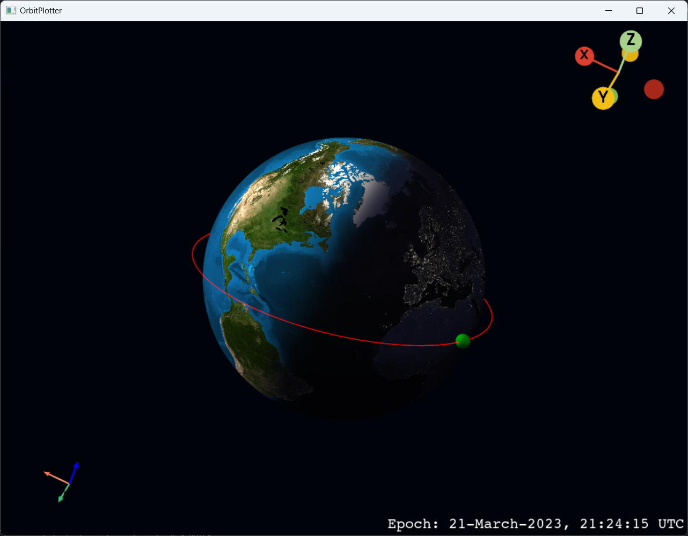
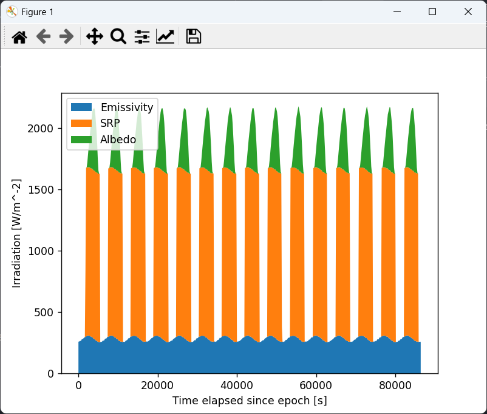

# Orbit and Radiation Simulator

ORSim is an open source Python library for astrodynamic propagation of Earth satellites, developed as part of a Aerospace Engineering Bachelor's Thesis at the University of León (ULE). It also features a model that estimates the incident radiation on a satellite along the orbit for energy budget and thermal design purposes. 

## Table of Contents
- [Orbit and Radiation Simulator](#orbit-and-radiation-simulator)
	- [Table of Contents](#table-of-contents)
	- [Requirements](#requirements)
	- [Usage](#usage)
		- [Epoch](#epoch)
		- [Spacecraft](#spacecraft)
		- [Orbit definition](#orbit-definition)
		- [Orbit visualization](#orbit-visualization)
		- [Radiation](#radiation)
	- [Citation](#citation)

## Requirements

ORSim requires the following Python packages:
- [`numpy`](https://numpy.org/): numerical utilities.
- [`pandas`](https://pandas.pydata.org/): for data handling.
- [`numba`](https://numba.pydata.org/): for accelerating the code.
- [`scipy`](https://scipy.org/): for numerical propagation and interpolation.
- [`pyvista`](https://docs.pyvista.org/): for 3D orbit visualization.

ORSim was developed using Python 3.11.

## Usage
>[!NOTE]
> This code is part of `demo.py`.

First of all, we import the code to define the *epoch*, *spacecraft*, and *orbit* objects. All of the utilities to define the initial conditions can be found in the `core` folder.

```python
import numpy as np
import matplotlib.pyplot as plt

from core.time import Epoch
from core.spacecraft import SpaceCraft
from core.orbit import Orbit
```

### Epoch
The epoch is the time of start of the simulation. It is defined with a gregorian date, up to a precision of 1 μs. The month can be set with both a string (`'Jan'`, `'Feb'`, ...) or a number.
```python
epoch = Epoch(yr=2023, mo="Mar", day=20, h=21, mins=24, s=15.386145)
```

> [!IMPORTANT]  
> Due to the use of [Celestrak's Earth Orientation Parameters (EOP) catalogue](https://celestrak.org/SpaceData/), the possible epochs are limited between January 1, 1962 and 6 months from the current date.

The [`Epoch`](core/time.py) object can be expressed in a number of common time representations with the following class methods:
- `UTC`: Universal Time Coordinated.
- `JD_UTC`: Julian date of UTC.
- `UT1`: UTC corrected for polar movement.
- `JD_UT1`: Julian date of UT1.
- `T_UT1`: Julian centuries of UT1.
- `TAI`: International Atomic Time.
- `TT`: Terrestrial Time.
- `JD_TT`: Julian Date of TT.
- `T_TT`: Julian centuries of TT.
- `TDB`: Barycentric Dynamical Time.
- `JD_TDB`: Julian date of TDB.
- `T_TDB`: Julian centuries of TDB.

### Spacecraft
This object defines the material properties of the satellite.
These are: mass in [kg], the atmospheric drag coefficient and its reference area in [m<sup>2</sup>], the radiation reflectivity coefficient and its reference area in [m<sup>2</sup>].
Despite not being strictly necessary for the resolution of the Keplerian problem, they are essential for the inclusion of orbital perturbations.
```python
satellite = SpaceCraft(mass=850, CD=2.0, A_drag=15, CR=1.8, A_srp=15)
```

### Orbit definition

After defining the spacecraft and epoch, it is possible to propagate as many orbits as desired. The initial state of the satellite (i.e. the orbit it will describe) can be initialized in different ways:
- ~~`circular`~~ 
- `sunSynchronous`: Sun synchronous orbit that automatically calculates the corresponding inclination.
- `from_elements`: Given the Keplerian elements.
- `from_vectors`: Given numpy arrays for position ($\vec{r}$) and velocity ($\vec{v}$) in the GCRF J2000.0 coordinate system.

Each of these methods internally transforms the given parameters to a [`StateVector`](core/state.py), a special class that holds both the 3D state vector form of the orbit, and the Keplerian elements. These representations can be obtained both individually (`position`, `velocity`, `sma`, `ecc`, `inc`, ...) and in the form of tuples (`.to_vectors`, `.to_elements`) or dictionaries (`.to_dict`).

```python
# Keplerian Elements
sma = 6932.1363  # [km]
ecc = 0.004
inc = np.radians(23.6)  # [rad]
raan = np.radians(25.6)  # [rad]
aop = np.radians(98.5)  # [rad]
ta = np.radians(12.2)  # [rad]

orb1 = Orbit.from_elements(epoch, satellite, sma, ecc, inc, raan, aop, ta)
```

After instantiating the orbit, it is necessary to explicitly declare the orbital perturbations to be included in the propagation. Six of them have been implemented in this model:
- `gravity`: Nonspherical Earth up to J6 zonal harmonics.
- `drag`: Exponential model of the atmosphere.
- `third_body`: Sun and Moon contributions (with the corresponding ephemeris calculations).
- `solar_radiation_pressure`: SRP influence given the yearly variation and eclipses.
- `albedo`: SRP bouncing off the Earth.
- `longwave`: Radiation emitted by the Earth.
```python
orb1.setPerturbations(
	gravity=False,
	drag=False,
	third_body=False,
	solar_radiation_pressure=False,
	albedo=False,
	longwave=False,
)
```

The orbit can be propagated with two methods:
- `"KeplerUniversal"`: universal algorithm for Kepler's problem for the resolution of the ideal orbit independently of the conical section of the orbit. It only provides the final state vector after the elapsed time, with no intermediate positions. Orbital perturbations can't be accounted with this method.
- `"Cowell"`: numerical integration of the complete orbit accounting for orbital perturbations and collision events. Returns a number of products including the different time steps (`trajectory.t`) and the position and velocity vectors of each iteration (`trajectory.y`).
```python
>>> simulation_time = 86400  # In seconds
>>> trajectory = orb1.propagate(simulation_time, method="Cowell")
=========================================================================
         Orbit propagation at Epoch: 20-March-2023, 21:24:15 UTC
-------------------------------------------------------------------------
Integration time (sec): 0.127645
Final epoch: 21-March-2023, 21:24:15 UTC
Final position (km): [-5867.648148, 2874.880631, 2240.362873]
Final velocity (km/s): [-3.805304, -6.344802, -1.781517]
Final elements:
      SMA (km): 6932.136300
           ECC: 0.004000
     INC (deg): 23.600000
    RAAN (deg): 25.600000
     AOP (deg): 98.500000
      TA (deg): 27.390560
=========================================================================
```

### Orbit visualization

When the current orbit has been propagated with Cowell's method, it can also be plotted in an interactive window, where the Earth is oriented and illuminated by the Sun at the corresponding final position.
```python
>>> orb1.plotTrajectory(daynight=True)
```


### Radiation

The `radiation` module allows the estimation of the radiation profile incident on the entire satellite when describing the orbit.
The irradiation is given in [W/m<sup>2</sup>] and it is decomposed in its three components.

It requires a single parameter, `gridSpacing`, determines the angular spacing between parallels and meridians for Earth's meshing in degrees.
>[!WARNING]
> `gridSpacing` must be a divisor of 360.

```python
>>> solar, albedo, olr = orb1.radiation(gridSpacing=5)
*************************************************************************
Received irradiation
-------------------------------------------------------------------------
Computation time (sec): 7.703641
*************************************************************************
>>> plt.xlabel("Time elapsed since epoch [s]")
... plt.ylabel("Irradiation [W/m^-2]")
... labels = ["Emissivity", "SRP", "Albedo"]
... plt.stackplot(trajectory.t, olr, solar, albedo, labels=labels)
... plt.legend(loc="upper left")
... plt.show()
```


## Citation
```bib
@mastersthesis{Paz2023,
	title   = {Space Radiative Environment Simulator},
	author  = {Alejandro Paz},
	year    = 2023,
	month   = {september},
	address = {León, Spain}
	school  = {ULE},
	type    = {Bachelor's thesis}
}
```